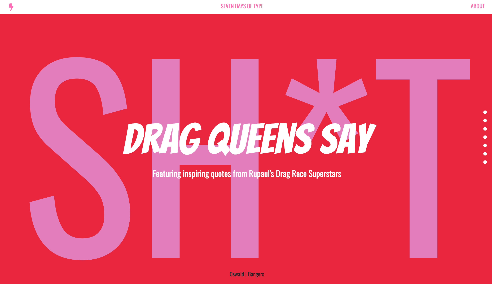

# spring-break-type

This project was assigned as hw for SCCA's typography 1 course. The class was tasked with creating 7 typographic layouts while seamlessly exploring hierarchy, color, and orientation. Check out the live site here: [7 Days of Type.](https://aheitzen.github.io/spring-break-type/#day-seven)

**Technologies used**
* HTML5 
* CSS3
* Google Fonts 
* Font Awesome
* jQuery 
* Bootstrap

**Approach taken**
* Wireframe
* Research quotes (copy) and new technology
* Using html and css, built the structural markup and styled
* Implemented vertical side navigation

**Unsolved problems** 
* Not responsive 

